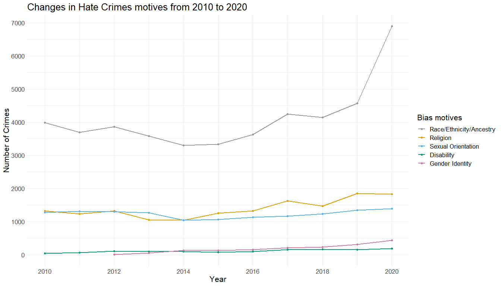
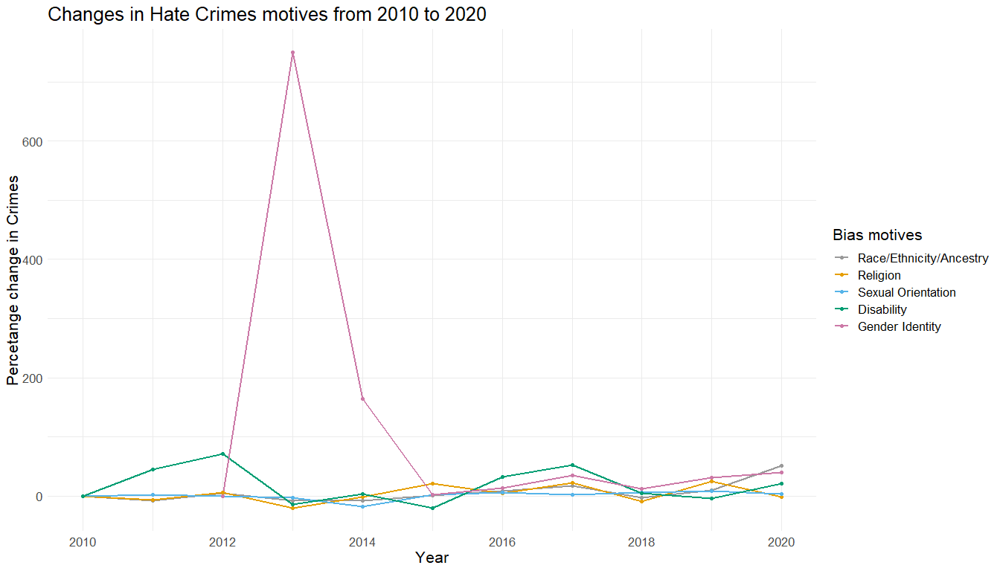
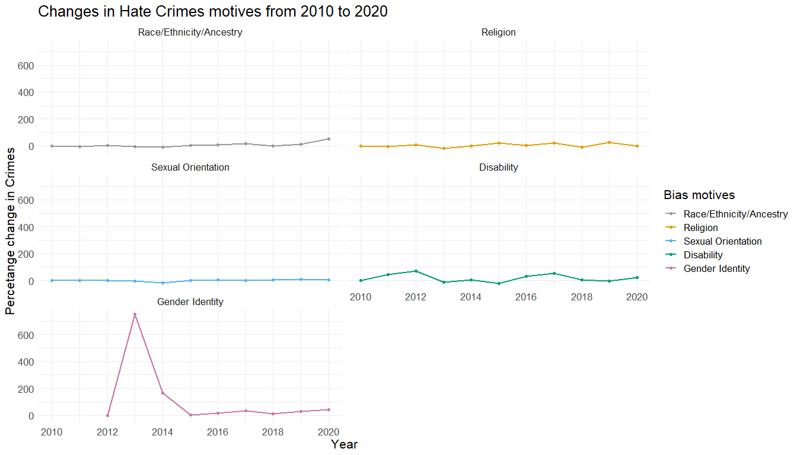

hate_crime_in_US
================
Jolie Pham
2023-01-03

``` r
library(dplyr) 
library(ggplot2) 
library(knitr) 
library(tidyverse)
library(here)
library(stringr)
library(lubridate)
```

``` r
# load dataset
hate_crime <- read_csv(here("hate_crime.csv"))

# take a glimpse
glimpse(hate_crime)
```

    ## Rows: 219,577
    ## Columns: 28
    ## $ INCIDENT_ID              <dbl> 3015, 3016, 43, 44, 3017, 3018, 3019, 45, 46,…
    ## $ DATA_YEAR                <dbl> 1991, 1991, 1991, 1991, 1991, 1991, 1991, 199…
    ## $ ORI                      <chr> "AR0040200", "AR0290100", "AR0350100", "AR035…
    ## $ PUB_AGENCY_NAME          <chr> "Rogers", "Hope", "Pine Bluff", "Pine Bluff",…
    ## $ PUB_AGENCY_UNIT          <chr> NA, NA, NA, NA, NA, NA, NA, NA, NA, NA, NA, N…
    ## $ AGENCY_TYPE_NAME         <chr> "City", "City", "City", "City", "City", "City…
    ## $ STATE_ABBR               <chr> "AR", "AR", "AR", "AR", "AR", "AR", "AR", "AR…
    ## $ STATE_NAME               <chr> "Arkansas", "Arkansas", "Arkansas", "Arkansas…
    ## $ DIVISION_NAME            <chr> "West South Central", "West South Central", "…
    ## $ REGION_NAME              <chr> "South", "South", "South", "South", "South", …
    ## $ POPULATION_GROUP_CODE    <chr> "5", "6", "3", "3", "3", "3", "2", "3", "3", …
    ## $ POPULATION_GROUP_DESC    <chr> "Cities from 10,000 thru 24,999", "Cities fro…
    ## $ INCIDENT_DATE            <chr> "31-AUG-91", "19-SEP-91", "04-JUL-91", "24-DE…
    ## $ ADULT_VICTIM_COUNT       <dbl> NA, NA, NA, NA, NA, NA, NA, NA, NA, NA, NA, N…
    ## $ JUVENILE_VICTIM_COUNT    <dbl> NA, NA, NA, NA, NA, NA, NA, NA, NA, NA, NA, N…
    ## $ TOTAL_OFFENDER_COUNT     <dbl> 1, 1, 1, 1, 1, 1, 2, 1, 2, 10, 2, 1, 0, 1, 1,…
    ## $ ADULT_OFFENDER_COUNT     <dbl> NA, NA, NA, NA, NA, NA, NA, NA, NA, NA, NA, N…
    ## $ JUVENILE_OFFENDER_COUNT  <dbl> NA, NA, NA, NA, NA, NA, NA, NA, NA, NA, NA, N…
    ## $ OFFENDER_RACE            <chr> "White", "Black or African American", "Black …
    ## $ OFFENDER_ETHNICITY       <chr> NA, NA, NA, NA, NA, NA, NA, NA, NA, NA, NA, N…
    ## $ VICTIM_COUNT             <dbl> 1, 1, 1, 2, 1, 1, 1, 2, 1, 2, 1, 1, 1, 1, 1, …
    ## $ OFFENSE_NAME             <chr> "Intimidation", "Simple Assault", "Aggravated…
    ## $ TOTAL_INDIVIDUAL_VICTIMS <dbl> 1, 1, 1, 1, 1, 1, 1, 2, 1, 2, 1, 1, 1, 1, 1, …
    ## $ LOCATION_NAME            <chr> "Highway/Road/Alley/Street/Sidewalk", "Highwa…
    ## $ BIAS_DESC                <chr> "Anti-Black or African American", "Anti-White…
    ## $ VICTIM_TYPES             <chr> "Individual", "Individual", "Individual", "In…
    ## $ MULTIPLE_OFFENSE         <chr> "S", "S", "S", "M", "S", "S", "S", "M", "S", …
    ## $ MULTIPLE_BIAS            <chr> "S", "S", "S", "S", "S", "S", "S", "S", "S", …

There are many useful information here but we only need a few variables
to build the visualisation, particularly the Indicent ID, the year when
the incident happened and the underlying bias. We will also filter the
incidents happened from 2010 to 2020 only.

It is noticeable that some observations of the `BIAS_DESC` column have
more than one bias listed and they are separated by a semi-colon (;) so
we will need to separate them into different rows and include each of
the bias to the total count based on year and bias.

As you can see, we have 35 bias motives in total.

``` r
hate_crime <- hate_crime %>%
  select('INCIDENT_ID', 'DATA_YEAR', 'BIAS_DESC') %>%
  filter(DATA_YEAR > 2009) %>%
  separate_rows(BIAS_DESC, sep = ";") %>%
  group_by(DATA_YEAR, BIAS_DESC) %>%
  summarise(CRIMES_NO = n())

# amount of biases
n_distinct(hate_crime$BIAS_DESC)
```

    ## [1] 35

``` r
# display distinct values
hate_crime %>% distinct(BIAS_DESC)
```

    ## # A tibble: 323 × 2
    ## # Groups:   DATA_YEAR [11]
    ##    DATA_YEAR BIAS_DESC                            
    ##        <dbl> <chr>                                
    ##  1      2010 Anti-American Indian or Alaska Native
    ##  2      2010 Anti-Asian                           
    ##  3      2010 Anti-Atheism/Agnosticism             
    ##  4      2010 Anti-Bisexual                        
    ##  5      2010 Anti-Black or African American       
    ##  6      2010 Anti-Catholic                        
    ##  7      2010 Anti-Gay (Male)                      
    ##  8      2010 Anti-Heterosexual                    
    ##  9      2010 Anti-Hispanic or Latino              
    ## 10      2010 Anti-Islamic (Muslim)                
    ## # … with 313 more rows

In order to tackle the overlapping issues I will try to group the
motives to bigger and more generalized groups, which include:

Race/Ethnicity/Ancestry Religion Sexual Orientation Disability Gender
Identity

The grouping system is inspired by information on FBI’s website. The
only difference is that I would combine “Gender” (including Anti-Male
and Anti-Female) and “Gender Identity” (including Anti-Transgender and
Anti-Gender Non-Conforming) to one group only to make sure our line
chart is not too crowded and clustered.

``` r
# divide into groups
race <- c("Anti-Black or African American", 
          "Anti-White",
          "Anti-American Indian or Alaska Native", 
          "Anti-Asian", 
          "Anti-Native Hawaiian or Other Pacific Islander", 
          "Anti-Multiple Races, Group", 
          "Anti-Arab", 
          "Anti-Hispanic or Latino", 
          "Anti-Other Race/Ethnicity/Ancestry")


religion <- c("Anti-Jewish", 
              "Anti-Catholic", 
              "Anti-Protestant", 
              "Anti-Islamic (Muslim)", 
              "Anti-Other Religion", 
              "Anti-Multiple Religions, Group",
              "Anti-Mormon", 
              "Anti-Jehovah's Witness", 
              "Anti-Eastern Orthodox (Russian, Greek, Other)", 
              "Anti-Other Christian", 
              "Anti-Buddhist", 
              "Anti-Hindu", 
              "Anti-Sikh", 
              "Anti-Atheism/Agnosticism")

sexual <- c("Anti-Gay (Male)", 
            "Anti-Lesbian (Female)", 
            "Anti-Lesbian, Gay, Bisexual, or Transgender (Mixed Group)", 
            "Anti-Heterosexual", 
            "Anti-Bisexual")

disability <- c("Anti-Physical Disability", 
                "Anti-Mental Disability")

gender <- c("Anti-Male", 
            "Anti-Female", 
            "Anti-Transgender", 
            "Anti-Gender Non-Conforming")
```

After defining which bias will fall into which category, I mutate
another column called `BIAS_GROUP` to the dataset and remove any NA
values.

``` r
hate_crime <- hate_crime %>%
  mutate(BIAS_GROUP = case_when(BIAS_DESC %in% race ~ "Race/Ethnicity/Ancestry",
                                BIAS_DESC %in% religion ~ "Religion",
                                BIAS_DESC %in% sexual ~ "Sexual Orientation",
                                BIAS_DESC %in% disability ~ "Disability",
                                BIAS_DESC %in% gender ~ "Gender Identity",
                                TRUE ~ as.character(NA))) %>%
  drop_na()
```

``` r
# total crimes per bias motive groups
hate_crime_grouped <- hate_crime %>%
  group_by(DATA_YEAR, BIAS_GROUP) %>%
  summarise(CRIMES_NO = sum(CRIMES_NO))

# change to factor and specify factor levels
hate_crime_grouped$BIAS_GROUP <- factor(hate_crime_grouped$BIAS_GROUP,
                                        levels = c("Race/Ethnicity/Ancestry",
                                                   "Religion",
                                                   "Sexual Orientation",
                                                   "Disability",
                                                   "Gender Identity"))
                                 

# The palette with grey:
cbPalette <- c("#999999", "#E69F00", "#56B4E9", "#009E73", "#CC79A7", "#0072B2", "#D55E00")


# viz
ggplot(hate_crime_grouped, aes(DATA_YEAR, CRIMES_NO, colour = BIAS_GROUP, group = BIAS_GROUP)) +
  geom_line(size = 1) +
  geom_point(size = 1.5) +
  labs(title = "Changes in Hate Crimes motives from 2010 to 2020",
       x = "Year",
       y = "Number of Crimes",
       colour = "Bias motives") +
  scale_x_continuous(breaks = seq(2010, 2020, 2)) +
  scale_y_continuous(breaks = seq(0, 7000, 1000)) +
  scale_colour_manual(values=cbPalette) +
  theme_minimal() +
  theme(text = element_text(size = 16))
```

<!-- -->
Another way to visualise the trends of hate crime over the years is
looking into the percentage change after each year. To do this, I will
mutate a new column called `PCT_CHANGE`, which is the difference in
percentage between year n and year n-1. Doing the visualisation in this
way means we have all the lines starting from the same point of zero so
we can compare how significantly they have changed.

It is quite interesting that when we plot the data using the percentage
change, the pink line which represents hate crime against bias in
victim’s gender identity has increased significantly in 2013. In fact,
when we look at the raw data, there were only 6 cases recorded in 2012
but this number surged to 51 in 2013, then 135 in 2014.

``` r
hate_crime_pct <- hate_crime_grouped %>%
  group_by(BIAS_GROUP) %>%
  arrange(DATA_YEAR, .by_group = TRUE) %>%
  mutate(PCT_CHANGE = round((CRIMES_NO / lag(CRIMES_NO) - 1) * 100, digits = 2)) %>%
  mutate_at(vars("PCT_CHANGE"), ~replace_na(.,0))


ggplot(hate_crime_pct, aes(DATA_YEAR, PCT_CHANGE, colour = BIAS_GROUP, group = BIAS_GROUP)) +
  geom_line(size = 1) +
  geom_point(size = 1.5) +
  labs(title = "Changes in Hate Crimes motives from 2010 to 2020",
       x = "Year",
       y = "Percetange change in Crimes",
       colour = "Bias motives") +
  scale_x_continuous(breaks = seq(2010, 2020, 2)) +
  scale_colour_manual(values=cbPalette) +
  theme_minimal() +
  theme(text = element_text(size = 16))
```

<!-- -->

``` r
ggplot(hate_crime_pct, aes(DATA_YEAR, PCT_CHANGE, colour = BIAS_GROUP, group = BIAS_GROUP)) +
  geom_line(size = 1) +
  geom_point(size = 1.5) +
  facet_wrap(~ BIAS_GROUP, ncol=2) +
  labs(title = "Changes in Hate Crimes motives from 2010 to 2020",
       x = "Year",
       y = "Percetange change in Crimes",
       colour = "Bias motives") +
  scale_x_continuous(breaks = seq(2010, 2020, 2)) +
 # ylim(-25, 75) + 
  scale_colour_manual(values=cbPalette) +
  theme_minimal() +
  theme(text = element_text(size = 16))
```

<!-- -->
